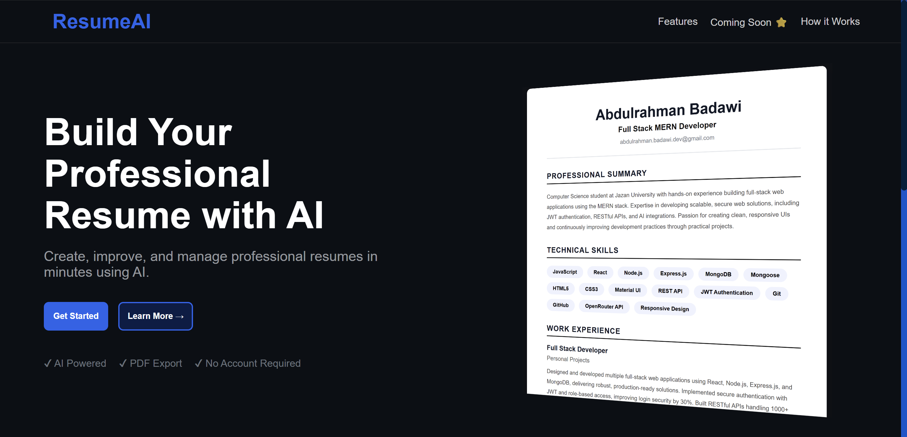
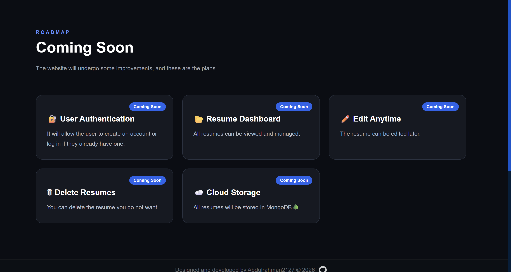
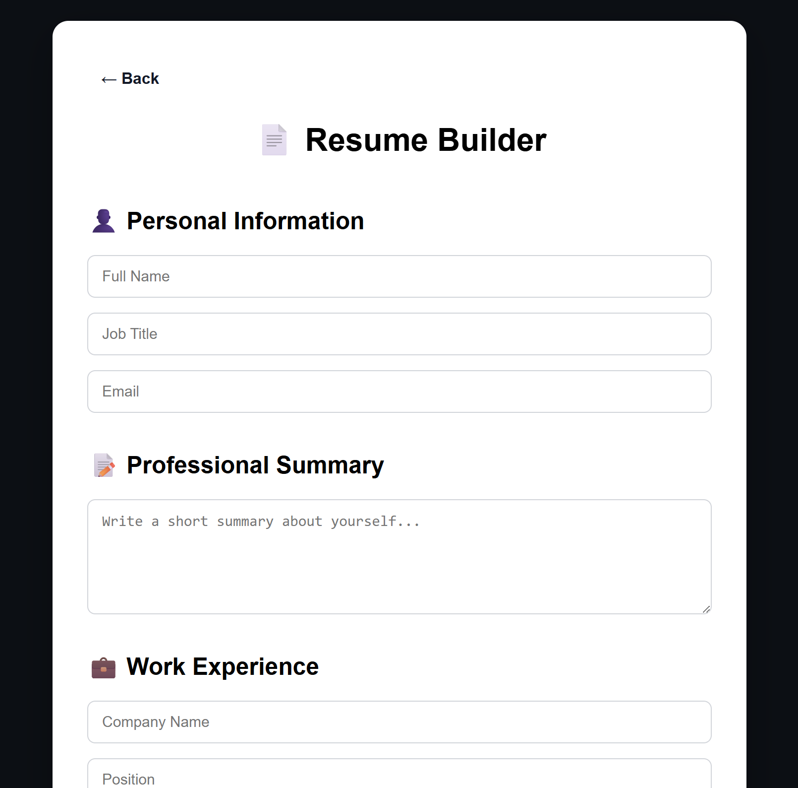

# ResumeAI

ResumeAI is a modern AI-powered resume builder designed to help users create professional resumes quickly and easily.

## ✨ Features

- Modern and responsive landing page.
- AI-powered resume generation.
- Clean and user-friendly interface.
- Smooth scrolling navigation.
- Mobile-friendly design.

## 🚀 Upcoming Features

- User authentication (Sign Up / Login)
- Resume dashboard
- Create multiple resumes
- Edit existing resumes
- Delete resumes
- Secure cloud storage
- PDF export improvements

## 🛠️ Technologies

- React
- CSS3
- JavaScript
- Vite

## 📸 Preview

## 📄 License

This project is created for learning and portfolio purposes.